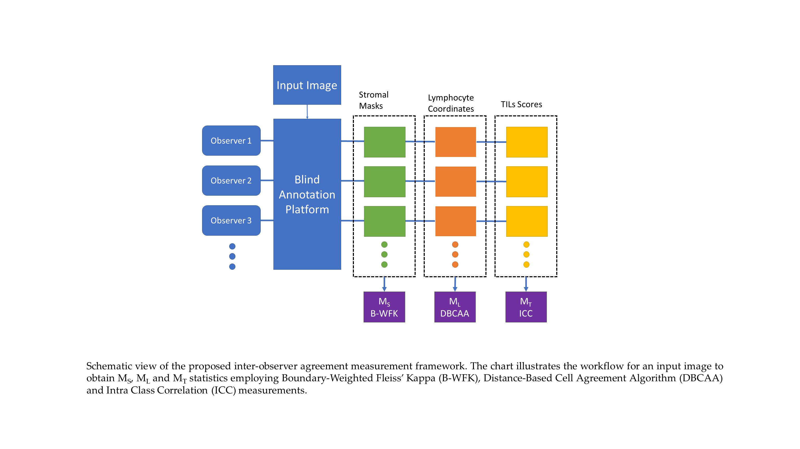
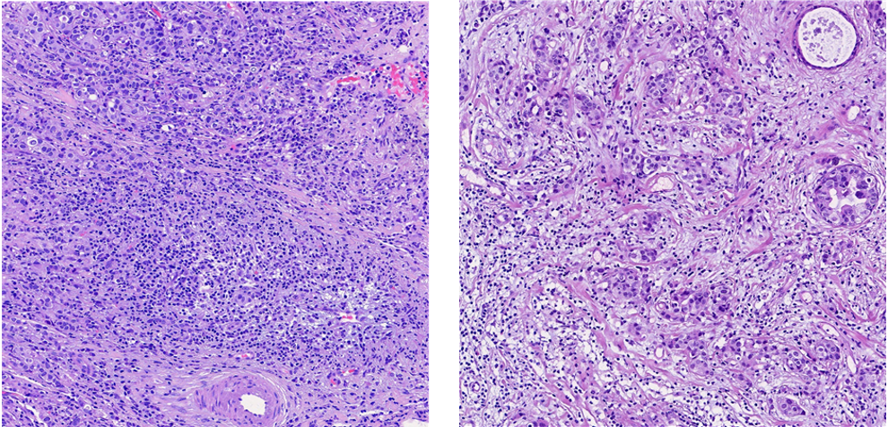
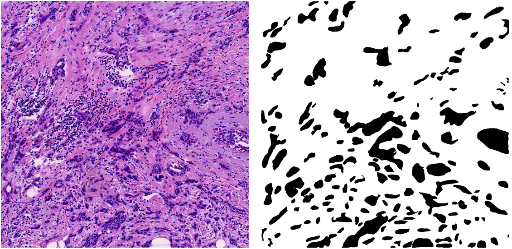
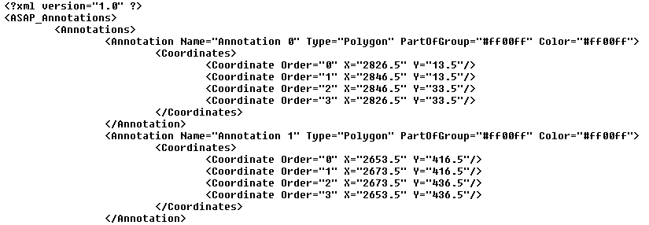

# An Interpretable Framework for Inter-Observer Agreement Measurement in TILs Scoring on Histopathologic Breast Images

## Abstract
Breast cancer, a widespread and life-threatening disease, necessitates precise diagnostic tools for improved patient outcomes. Tumor-Infiltrating Lymphocytes (TILs), reflective of the immune response against cancer cells, are pivotal in understanding breast cancer behavior. However, in-ter-observer variability in TILs scoring methods poses challenges to reliable assessments. This study introduces a novel and interpretable framework comprising two innovative inter-observer agreement measures. The first method, Boundary-Weighted Fleiss’ Kappa (BWFK), addresses tissue segmentation predictions, focusing on mitigating disagreements along tissue boundaries. BWFK enhances the accuracy of stromal segmentation, providing a nuanced assessment of in-ter-observer agreement. The second proposed method, the Distance Based Cell Agreement Al-gorithm (DBCAA), eliminates the need for ground truth annotations in cell detection predictions. This groundbreaking approach offers versatility across histopathologic analyses, overcoming data availability challenges. Both methods are utilized to assess inter-observer agreement using the clinical dataset generated within the study. Experimental investigations demonstrate that the BWFK method yielded gains of up to 32% compared to the standard FK model. Furthermore, the procedure for conducting clinical validations of artificial intelligence (AI) based cell detection methods is elucidated. Thoroughly validated on a clinical dataset, the framework contributes to standardized, reliable, and interpretable inter-observer agreement assessments. The study is the first examination of inter-observer agreements in stromal segmentation and lymphocyte detection for the TILs scoring problem. The study emphasizes the potential impact of these measures in advancing histopathologic image analysis, fostering consensus in TILs scoring, and ultimately improving breast cancer diagnostics and treatment planning. The source codes and implementa-tion guideline of this study are publicly available at https://github.com/cialab/TILs_Interobserver_Agreement_Measures. 

## Graphical Abstract


## Implementation Guide

### 1) Prepare input images
Prepare the histopathological images to measure the inter-observer agreements. Images can be obtained by capturing from microscopes or cutting patches from whole slide images.



### 2) Annotations
Use a platform such as Roboflow (https://roboflow.com), LabelMe (http://labelme.csail.mit.edu/Release3.0), LabelBox (https://labelbox.com) or use another commercial software to obtain the annotations of observers. Besides, you can run your AI methods on the input images to get AI based annotations. 
* Regional Annotations: Create binary mask images to remark the annotated stromal regions for each input image and each observer. Mask images must be the same size as input images. Sample mask images are given in sample_data folder.


* Cell Annotations: Cells are marked with boundary boxes by observers. Cell boundary boxes are stored as ASAP xml file format (https://github.com/computationalpathologygroup/ASAP). Sample cell coordonate xml files are given in sample_data folder.


### 3) Prepare data folders
Data folder is prepared to run the agreement measures. Structure of the folder should has the following format:
```
DATA_DIRECTORY/
├── image1/
    ├── observer1/
      ├── mask.png
      ├── lymphocyte.xml  
    ├── observer2/
      ├── mask.png
      ├── lymphocyte.xml  
    └── ...
├── image2/
    ├── observer1/
      ├── mask.png
      ├── lymphocyte.xml  
    ├── observer2/
      ├── mask.png
      ├── lymphocyte.xml  
    └── ...
└── ...
```
A sample folder is given in sample_data folder.
### 4) Run measurements

Run the codes to calculate inter-observer agreement measurements for the sample data folder as follows:
* **For BWFK:** Execute the code provided in BWFK.py to compute stromal inter-observer agreement values.
* **For DBCAA:** Execute the code provided in DBCAA.py to compute lymphocyte detection inter-observer agreement values.
* **For TILS ICC:** Execute the code provided in TILs_ICC.py to calculate the TILs scores and ICC inter-observer agreement values.

### 5) Interpret results
The results obtained by following this guide can serve various purposes:
* **Validation of AI methods:** The guide facilitates the validation of AI methods. The results generated by an AI method can be processed as an observer and compared with the results of physician observers to validate the performance of the method.
* **Pathologist training:** The guide can be utilized for pathologist training to enhance inter-observer concordance on TILs scoring. It enables the assessment of stromal segmentation, lymphocyte detection, and overall TILs scoring-based agreements. Statistical examination of these agreements can help identify the sources of inter-observer variabilities in TILs scoring.


